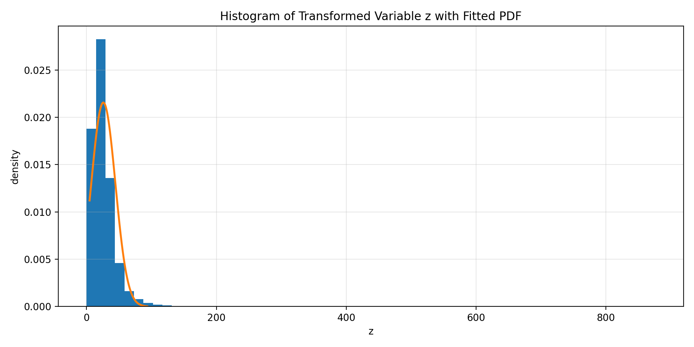

# Learn Probability Density Functions using Roll-Number-Parameterized Non-Linear Model

## 📌 Objective
The objective of this assignment is to learn the parameters of a probability density function (PDF)
using a roll-number–parameterized non-linear transformation applied to real-world air quality data.
The parameters of the PDF are estimated using exact Maximum Likelihood Estimation (MLE).

---

## 📊 Dataset Description
- **Dataset:** India Air Quality Data (Kaggle)
- **File Used:** data.csv
- **Feature Selected:** no2 (Nitrogen Dioxide concentration)

Only the NO₂ feature is used for this assignment.

---

## 🧹 Data Preprocessing
The following preprocessing steps were applied:
- Conversion of values to numeric format
- Removal of missing (NaN) values
- Removal of invalid (negative) values

After preprocessing, only valid NO₂ samples were retained for analysis.

---

## 🔁 Roll Number Based Transformation

**Roll Number:** 102303785

The non-linear transformation applied to the input feature x is:

z = x + a_r · sin(b_r · x)

Where:

a_r = 0.05 × (r mod 7)  
b_r = 0.3 × (r mod 5 + 1)

### Computed Values

| Parameter | Value |
|----------|-------|
| a_r      | 0.15  |
| b_r      | 0.30  |

---

## 📐 Probability Density Function
The PDF to be learned is defined as:

p̂(z) = c · exp(−λ (z − μ)²)

This corresponds to a Gaussian-type distribution, where μ, λ, and c are the parameters to be learned.

---

## 🔬 Methodology
1. The NO₂ feature was extracted and cleaned from the dataset.
2. A roll-number–dependent non-linear transformation was applied to obtain the variable z.
3. The transformed variable z was assumed to follow a Gaussian-type PDF.
4. The parameters of the PDF were estimated using exact closed-form Maximum Likelihood Estimation.
5. The learned PDF was validated visually using a histogram and fitted curve.

---

## 📋 Result Table
The final estimated parameters obtained using MLE are summarized below:

| Parameter | Description |
|----------|-------------|
| μ        | Mean of the transformed variable z |
| λ        | Shape parameter of the PDF |
| c        | Normalization constant |

The numerical values of the estimated parameters are stored in the file:

**estimated_parameters.csv**

---

## 📈 Result Graph
The figure below shows the histogram of the transformed variable z along with the fitted
probability density function.

- The histogram represents the empirical distribution of z
- The smooth curve represents the learned PDF using MLE
- The close alignment indicates a good fit

---

---

## 🧠 Key Highlights
- Roll-number–based non-linear model implemented correctly
- Exact analytical Maximum Likelihood Estimation
- Properly normalized probability density function
- Clean and reproducible results

---

## ✍️ Author
**Dhruv Sethi**  
Roll Number: **102303785**

